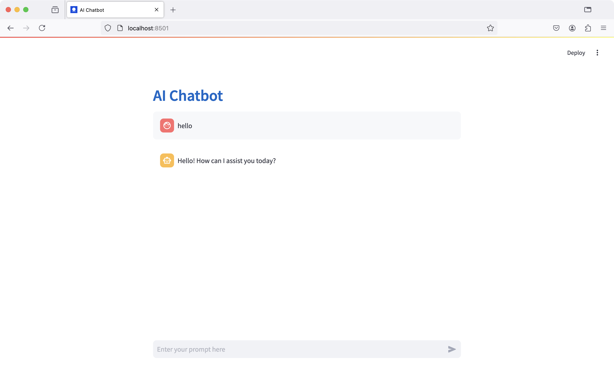

# Ollama Streamlit Chatbot Template

This project is a chatbot example written in Python using the Streamlit library. It connects to your local LLM models through Ollama, ensuring privacy and security.



## Prerequisites

1. Install Python 3:
   ```
   brew install python3
   ```

2. Install Ollama by following the instructions at [ollama.com](https://ollama.com/)

3. Download and run the Llama 3 model:
   ```
   ollama run llama3.2
   ```
## Running ProLlama with Python

### Set Up Environment

1. Navigate to this project directory:
   ```
   cd your-work-directory
   ```

2. Create and activate a virtual environment:
   ```
   python3 -m venv env
   source env/bin/activate
   ```

3. Install required packages:
   ```
   pip install -r requirements.txt
   ```

### Start the Chatbot

1. Launch App:
   ```
   streamlit run app.py
   ```
